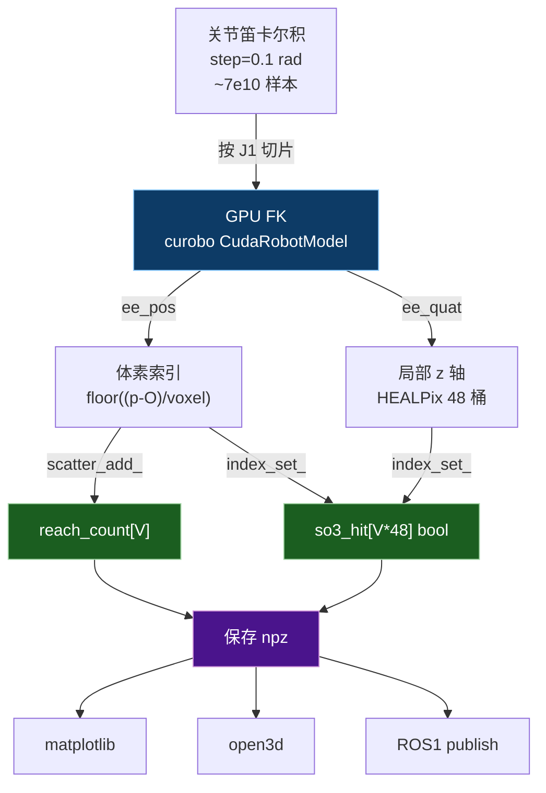

# JAKA 工作空间采样 + 可视化

> 用 curobo 的 GPU 并行 FK 暴力枚举 JAKA 7-DOF 全关节空间，量化成体素 + HEALPix 姿态桶，得到「位置可达 + 姿态覆盖率」的工作空间地图。

## 文件清单

```
workspace_rviz/
├── sample_workspace.py        # 采样器（核心）：GPU 并行 FK + 流式聚合 → npz
├── visualize_matplotlib.py    # 离线静态图：3D 散点 + 三视切片
├── visualize_open3d.py        # 交互式 3D 点云
├── publish_ros1.py            # ROS1 PointCloud2 话题发布
├── workspace_data.npz         # 采样结果（运行后生成）
├── workspace_meta.json        # 元信息（运行后生成）
└── figs/                      # matplotlib 输出图
```

## 数据流



## 用法

### 1) 采样（必须先跑）

```bash
# 烟雾测试（step=0.5, 几秒）：
/root/miniconda3/envs/curobo/bin/python sample_workspace.py --smoke

# 正式（step=0.1, 约 10-20 分钟，~7e10 样本）：
/root/miniconda3/envs/curobo/bin/python sample_workspace.py \
    --step 0.1 --voxel 0.01 --nside 2 \
    --bbox -1.5 -1.5 -1.5 1.5 1.5 1.5 --batch 4194304

# 关键参数
#   --step    每个关节采样步长 (rad)
#   --voxel   位置体素边长 (m)，默认 0.01 (=1cm)
#   --nside   HEALPix nside；桶数 = 12*nside^2；默认 2 → 48 桶
#   --bbox    工作空间包围盒 xmin ymin zmin xmax ymax zmax (m)
#   --batch   单次 FK batch；显存吃紧就调小（默认 1<<22 = 4M）
```

输出：
- `workspace_data.npz`：稀疏存储所有可达体素（位置/索引/计数/SO(3)覆盖桶数）
- `workspace_meta.json`：所有参数 + 统计

### 2) 离线静态图

```bash
/root/miniconda3/envs/curobo/bin/python visualize_matplotlib.py
# 输出 figs/scatter3d.png + figs/slices.png
```

### 3) 交互式 Open3D（本机带显示）

```bash
/root/miniconda3/envs/curobo/bin/python visualize_open3d.py
# 想用立方体而非点：加 --cube
# 只看高覆盖：加 --min-cov 0.5
```

### 4) ROS1 RViz（在装了 ROS1 noetic 的机器上）

```bash
roscore &                 # 启 master
python publish_ros1.py --topic /jaka/workspace --frame world --rate 1
# RViz: Add → PointCloud2 → Topic=/jaka/workspace → ColorTransformer=RGB8
```

## 数据格式（`workspace_data.npz`）

| 字段 | shape | dtype | 含义 |
|---|---|---|---|
| `voxel_centers` | (N,3) | float32 | 可达体素的 ee 位置中心 (m) |
| `voxel_index`   | (N,3) | int32   | 体素整数索引 (ix,iy,iz) |
| `reach_count`   | (N,)  | int64   | 落入该体素的关节配置数 |
| `so3_hit`       | (N,)  | int32   | 该体素覆盖到的 SO(3) 桶数（max=npix） |
| `npix`          | scalar | int32  | HEALPix 桶数 12*nside² |
| `voxel`         | scalar | float32 | 体素边长 (m) |
| `bbox`          | (6,)  | float32 | xmin ymin zmin xmax ymax zmax |
| `dims`          | (3,)  | int32   | 体素网格 (Nx,Ny,Nz) |

「姿态覆盖率」= `so3_hit / npix`，∈[0,1]。

## 性能数据（参考，L20 14GB）

| 配置 | 总样本 | 总耗时 | 可达体素 |
|---|---|---|---|
| step=0.5 烟雾 | 2.05 亿 | 3.4 s | 2.77M |
| step=0.1 正式（预计） | 6.94×10¹⁰ | ~10-20 min | ~5-15M |

## 注意

- curobo 输出四元数顺序是 **(w,x,y,z)**，本仓库脚本已按此处理。
- 用的 ee link 是 `tool` (LINK_7 沿 z 偏移 0.14m)，可改 `--ee-link`。
- `axis_z` 量化只覆盖了"末端朝向"的 S² 球面（48 桶），**不区分末端绕自身 z 的旋转**——这对一般抓取/喷涂任务足够；要真正 SO(3) 全覆盖需要双层 HEALPix（pos+twist），代码里没做。
