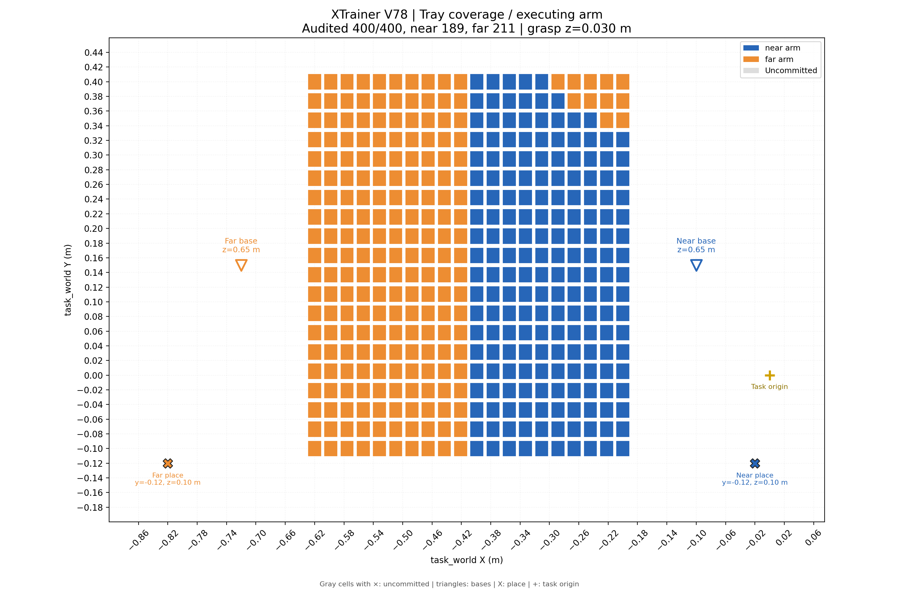
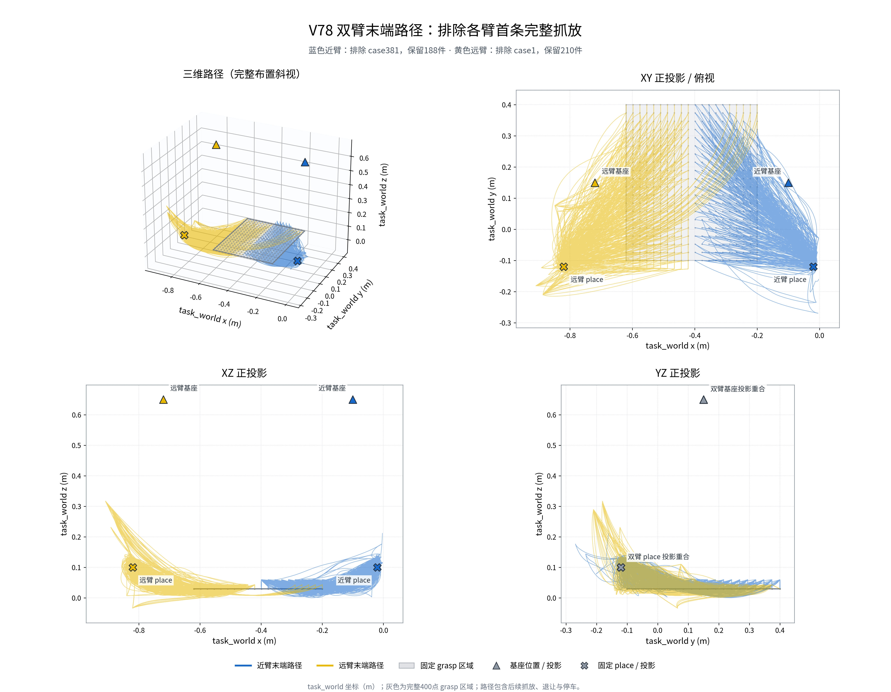

# V78 双臂整盘抓放结果

2026-10-01 发布。**400/400 个唯一抓取格点完成，800 个抓取/放置事件；近臂 189 件，远臂 211 件。** 仿真总时间 **2902.80 s（48.38 min）**，145141 个 20 ms 采样，156 个连续规划窗口。

这是已完成 V78 结果的发布副本。视频、图、原始关节轨迹和审计报告保留原文件内容；[manifest.json](manifest.json) 记录发布文件的 SHA256（文件内容校验值）。

## 视频与图片

- [完整整盘视频：v78_full_400_40x.mp4](video/v78_full_400_40x.mp4)，101.04 s，1440×1036，25 帧/s。名义采样速度 40 倍，额外保留全部 800 个事件帧及首尾停留，因此时长不等于仿真时间直接除以 40。
- [实际执行臂、grasp 区域、基座与 place 分布](distributions/executing_arm_cell_map.png)。
- [完整单件最大单关节累计变化](distributions/max_joint_cumulative_cell_map.png)、[最大关节跨度](distributions/max_joint_span_cell_map.png)。
- [全程最小有效关节限位余量](distributions/min_effective_margin_cell_map.png)。
- [双臂末端三维与 XY / XZ / YZ 投影](ee_paths/ee_paths_3d_projections.png)、[三维图](ee_paths/ee_paths_3d.png)、[俯视图](ee_paths/ee_paths_top.png)。近臂蓝色，远臂黄色。
- [逐格数值 CSV](distributions/cell_metrics.csv)、[覆盖统计](distributions/coverage_summary.json)。





## RViz 播放

需要 ROS1 Noetic、`rviz`、`robot_state_publisher` 及系统 Python 的 NumPy。只查看图片、视频和数据不需要 ROS；播放保存的轨迹不需要 GPU 或运行 CuRobo 规划。机器人网格使用本仓库已提交的 `src/curobo/content/assets/robot/ur_description/` 资产。

在克隆后的仓库根目录执行：

```bash
source /opt/ros/noetic/setup.bash
/usr/bin/python3 xtrainer_plan/published_results/v78_full_tray_20261001/play_in_rviz.py --speed 1 --once
```

播放器自动选择空闲 ROS master 端口，并启动独立的 ROS master、机器人状态发布器和 RViz。`--speed 1` 为仿真原速，改为 `--speed 10` 可加速；`--once` 播放一遍后保留最后姿态。关闭 RViz 或按 Ctrl+C 退出。

默认同时显示静态末端路径：近臂蓝色、远臂黄色，独立话题 `/xtrainer_plan/ee_paths`，配置为 [scene/ee_paths.rviz](scene/ee_paths.rviz)。在 RViz 的 **EE paths - near blue, far yellow** 图层下可以分别开关两臂；使用 `--ee-paths off` 隐藏路径。

末端路径图和 RViz 路径显示按之前要求排除各臂的第一条完整抓放：近臂 case381 保留从全局样本 716（14.32 s）开始的路径；远臂 case1 保留从样本 488（9.76 s）开始的路径。两臂独立截取并保留下一段共享起点，图中近臂 188 件、远臂 210 件。**实际机器人播放、整盘视频及关节轨迹仍保留完整 400 件。** 静态路径叠加展示空间分布，不表示两臂在同一时刻占据图中全部位置。

仅校验发布文件和轨迹，不启动 ROS 或 GUI：

```bash
/usr/bin/python3 xtrainer_plan/published_results/v78_full_tray_20261001/play_in_rviz.py --validate-only
```

## 结果指标

| 指标 | 整盘结果 | 使用门槛 |
|---|---:|---:|
| 最大完整单件单关节累计变化 | 209.519° | ≤210° |
| 最大完整单件关节跨度 | 114.754° | ≤150° |
| 最小有效关节限位余量 | 16.387° | ≥15° |
| 最小双臂代理球表面净距 | 55.003 mm | ≥55 mm |
| 最小单臂自碰代理球表面净距 | 5.750 mm | ≥3 mm |
| 双臂同时有真实关节运动 | 1143.98 s | 统计量 |
| 近臂 / 远臂实际关节静止时间 | 1098.60 / 773.20 s | 统计量 |
| 近臂 / 远臂最长连续静止 | 316.66 / 15.44 s | 统计量 |

`Cmax`（累计变化）是对每个关节累加完整单件相邻采样的绝对转角，再取六个关节的最大值；包含往返及计入该件的停车运动。`span`（跨度）是单件每个关节最大角减最小角，再取最大值。有效余量使用收紧后的 ±3.00 rad 限位；`rad` 是弧度，3.00 rad 约为 171.89°。净距是代理球表面距离，独立碰撞审计的插值间隔为 5 ms。

`EE` 为末端执行器，`TCP` 为工具中心点；本次末端轨迹使用 `TCP_LINK` / `far_TCP_LINK` 在 `task_world` 下的位置。最大完整单件 TCP 路长为 1.844 m（远臂 case400，含往返）；按保存采样计算的最大空间包围盒对角线为 0.819 m，同样来自 case400。

## 固定布置与协作策略

所有位置均在保留的 `task_world` 坐标系中，单位 m。

| 项目 | 近臂 | 远臂 |
|---|---|---|
| 基座 XYZ | (−0.10, 0.15, 0.65) | (−0.72, 0.15, 0.65) |
| 安装 RPY | (180°, −60°, 90°) | (180°, 60°, −90°) |
| 固定 place XYZ | (−0.02, −0.12, 0.10) | (−0.82, −0.12, 0.10) |

`XYZ` 表示三个坐标分量；`RPY` 分别表示绕固定 X/Y/Z 轴的 roll/pitch/yaw，按 URDF 的 `Rz(yaw) × Ry(pitch) × Rx(roll)` 合成旋转矩阵。实际安装矩阵保存在 [场景元数据](scene/scene.json)。

grasp 区域为 x=[−0.62,−0.20]、y=[−0.10,0.40]、z=0.03，20×20 格。两臂抓取倾角固定为原 grasp 参考姿态的 0°，在 `task_world` 下末端朝向一致；参考旋转矩阵为 `diag(−1, 1, −1)`，`diag` 表示以三个值作为主对角线的矩阵。place 姿态允许绕世界 Z 轴选择偏航，每臂所有物料重复同一个固定 place 坐标。

主体从两侧向中线按相邻蛇形抓取，通过时间调度允许同步、交错运动和局部等待。中线局部使用退让及远臂转运中间姿态。后段近臂保持已审计停姿，远臂接管原近臂高 y 难点，再完成自身剩余格点；停车运动完整保留并计入近臂单件预算。

原近臂改由远臂执行的格点编号：320、339、340、359、360、378、379、380、398、399、400。`case` 是唯一网格编号，定义为 `20 × ix + iy + 1`；`ix`、`iy` 是从 0 开始的 x/y 网格索引。接管是当前已验证策略，并不证明这些格点在其他近臂起始姿态和关节分支下均无法实现。

本结果采用 CuRobo 单臂轨迹规划、双臂时间调度和 12 关节联合碰撞审计；未证明总耗时为全局最短。代理球模型未包含夹持物、已放物料、完整工具外壳及线缆，假设上一放置物料已移走。

## 数据与证据

- [完整原始关节轨迹](data/full_trajectory.npz)：`positions` 为 N×12 关节角矩阵，单位 rad，N 为样本数；列名见 `joint_names`，前六列近臂、后六列远臂。`times` 单位 s，`window_index` 为从 0 开始的窗口索引，`*_window_source_index` 为对应窗口内原始轨迹样本号。
- [摘要与 800 个事件](data/summary.json)：记录格点、执行臂、抓放时刻、目标坐标和来源。`global_sample` 是完整轨迹中从 0 开始的样本号。
- [视频精确时间线](data/video_timeline.npz) 与 [时间线元数据](data/video_timeline.json)：用于原视频录制，关节采样与完整原始轨迹一致。
- [过滤后的精确末端数据](ee_paths/ee_paths_excluding_first_pieces.npz)、[过滤边界及来源](ee_paths/source_and_exclusion.json)、[数据一致性校验](ee_paths/data_validation.json)。
- [整盘独立核验](audits/independent_final_400_check.json)：400 个唯一格点、800 个事件、固定 place、共同 grasp 姿态、来源状态及指标一致性均通过。
- [视频逐帧审计](audits/video_render_audit.json)、[视频数据 CPU 校验](audits/video_cpu_validation.json)、[末段衔接审计](audits/chain_report.json)。`CPU` 表示中央处理器。

原摘要及审计 JSON 中的绝对路径保留为生成时的来源证据；部分指向历史实验目录。发布播放器只读取本目录文件及仓库机器人资产，不依赖那些历史路径。`--validate-only` 检查发布文件校验值、完整关节采样、事件覆盖和末端过滤范围；重新运行原来的规划与碰撞审计仍需要历史实验文件及对应环境。
